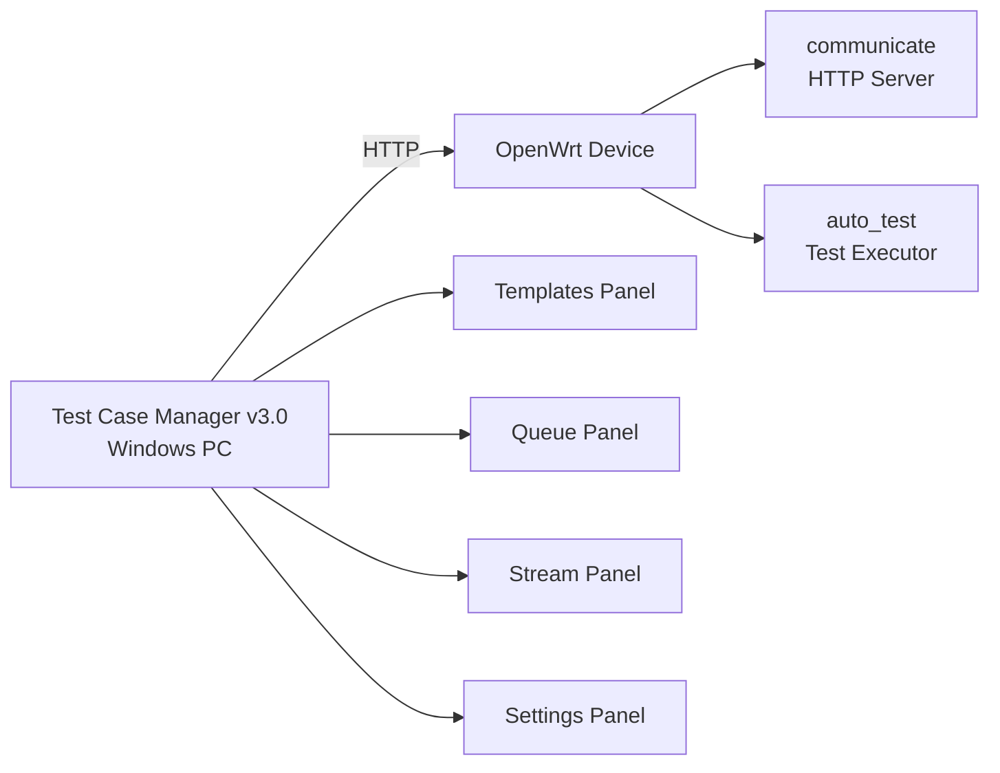

# Test Case Manager v3.0

**Comprehensive Test Case Management and Execution Tool for OpenWrt Devices**

[](https://github.com/juno-kyojin/winapp)
[](https://github.com/juno-kyojin/winapp)
[](https://python.org)
[](LICENSE)

## 🚀 Overview

Test Case Manager v3.0 is a professional Windows GUI application designed for comprehensive testing of OpenWrt devices. It provides an intuitive interface for creating, managing, and executing test cases remotely via HTTP protocol.

### ✨ Key Features

- 🎯 **Remote Test Execution**: Execute test cases on OpenWrt devices from Windows PC
- 📊 **Real-time Monitoring**: Live tracking of test execution progress
- 🔄 **Batch Processing**: Execute multiple test cases sequentially with queue management
- 🌐 **Network Testing**: Comprehensive network connectivity and performance testing
- 📡 **Wireless Testing**: Specialized support for WiFi configuration and testing
- 📈 **Result Analysis**: Detailed test results with execution time tracking
- 🔒 **Transaction Tracking**: Unique transaction IDs for reliable result mapping
- ⚡ **Standalone Executable**: No Python installation required for end users

### 🏗️ System Architecture



**Components:**
- **PC Application**: Windows GUI for test management and monitoring
- **Device Server**: HTTP server (`communicate`) handling client requests
- **Test Engine**: Test execution engine (`auto_test`) running on OpenWrt device

### 🎯 Target Users

- **QA Engineers**: Testing OpenWrt firmware and configurations
- **Network Engineers**: Validating network configurations and performance
- **DevOps Teams**: Automated testing in CI/CD pipelines
- **Support Teams**: Troubleshooting and diagnostics

## 📦 Installation & Setup

### 🔧 System Requirements

| Component | Requirement |
|-----------|-------------|
| **Operating System** | Windows 10/11 (64-bit) |
| **Python** | 3.8+ (for development) |
| **Network** | TCP connectivity to OpenWrt device |
| **Ports** | Port 6262 open on OpenWrt device |
| **Memory** | 4GB RAM minimum |
| **Storage** | 100MB free space |

### 🚀 Quick Start (Standalone Executable)

**For End Users - No Python Required:**

1. **Download** the latest release from [Releases](https://github.com/juno-kyojin/winapp/releases)
2. **Extract** the archive to your desired location
3. **Run** `TestCaseManager.exe`
4. **Configure** your OpenWrt device connection in Settings

### 🛠️ Development Setup

**For Developers:**

```bash
# Clone repository
git clone https://github.com/juno-kyojin/winapp.git
cd winapp/test_case_manager_v3

# Install Python dependencies
pip install -r requirements.txt

# Run from source
python main.py
```

### 🌐 Server Configuration

#### PC Application Setup:
1. **Launch** the application
2. **Navigate** to Settings panel
3. **Configure connection**:
   - **Server IP**: OpenWrt device IP (e.g., `192.168.1.4`)
   - **Port**: `6262` (default communicate server port)
   - **Timeout**: `30` seconds (recommended for wireless tests)
4. **Test connection** to verify connectivity

#### OpenWrt Device Setup:
```bash
# Start communicate HTTP server
cd /path/to/rnd_autotest/communicate
./communicate

# Start test execution engine
cd /path/to/rnd_autotest
./auto_test
```

**Verify Services:**
```bash
# Check if communicate server is running
netstat -ln | grep 6262

# Check if auto_test is monitoring
ps | grep auto_test
```
## 📋 Test Case Format

### 📝 JSON Structure

Test cases are defined in JSON format with the following structure:

```json
{
  "test_cases": [
    {
      "service": "service_name",
      "action": "action_name",
      "params": {
        "parameter1": "value1",
        "parameter2": "value2"
      }
    }
  ],
  "metadata": {
    "name": "Test Case Name",
    "description": "Description of what this test does",
    "version": "1.0.0",
    "tags": ["network", "connectivity"],
    "category": "network"
  }
}
```

### 🔧 Required Fields

| Field | Type | Required | Description |
|-------|------|----------|-------------|
| `test_cases` | Array | ✅ | Array of test case objects |
| `service` | String | ✅ | Service name (ping, wireless, lan, etc.) |
| `action` | String | ❌ | Specific action (default: "default") |
| `params` | Object | ✅ | Test parameters |

### 🔑 Transaction ID System

Transaction IDs are automatically generated with format:
```
YYYYMMDDHHMMSS_microseconds_uuid8chars
Example: 20250703095644_3041bf28
```

**Features:**
- ✅ **Auto-generated**: No need to specify in test JSON
- ✅ **Unique identification**: Each test gets unique ID
- ✅ **Result mapping**: Maps results from device to client
- ✅ **Tracking**: Enables real-time progress monitoring


## 📚 Test Case Examples

### 🌐 Network Tests

#### Basic Connectivity Test
```json
{
  "test_cases": [
    {
      "service": "ping",
      "params": {
        "host1": "google.com",
        "host2": "8.8.8.8",
        "count": 4
      }
    }
  ],
  "metadata": {
    "name": "Network Connectivity Test",
    "description": "Test internet connectivity to multiple hosts",
    "version": "1.0.0",
    "tags": ["network", "connectivity", "ping"],
    "category": "network"
  }
}
```

#### Speed Test
```json
{
  "test_cases": [
    {
      "service": "speedtest",
      "params": {
        "server": "auto",
        "duration": 30
      }
    }
  ],
  "metadata": {
    "name": "Internet Speed Test",
    "description": "Measure internet upload/download speeds",
    "version": "1.0.0",
    "tags": ["network", "speed", "bandwidth"],
    "category": "network"
  }
}
```

### 📡 Wireless Tests

#### WiFi Access Point Configuration
```json
{
  "test_cases": [
    {
      "service": "wireless",
      "action": "wireless_edit_ap",
      "params": {
        "ssid": "TestNetwork_5G",
        "password": "testpassword123",
        "encryption": "psk2",
        "channel": "auto",
        "bandwidth": "80"
      }
    }
  ],
  "metadata": {
    "name": "WiFi AP Configuration Test",
    "description": "Configure and test WiFi Access Point settings",
    "version": "1.0.0",
    "tags": ["wireless", "wifi", "ap", "configuration"],
    "category": "wireless"
  }
}
```

#### WiFi Station Mode Test
```json
{
  "test_cases": [
    {
      "service": "wireless",
      "action": "wireless_edit_sta",
      "params": {
        "ssid": "TargetNetwork",
        "password": "networkpassword",
        "encryption": "psk2"
      }
    }
  ],
  "metadata": {
    "name": "WiFi Station Connection Test",
    "description": "Test WiFi client connection to external network",
    "version": "1.0.0",
    "tags": ["wireless", "wifi", "station", "client"],
    "category": "wireless"
  }
}
```

> ⚠️ **Wireless Test Notes:**
> - Extended timeout (30+ retries, 2+ second delays)
> - May cause service restart → temporary connection loss
> - Requires longer wait times for completion

### 🖥️ System Tests

#### System Information
```json
{
  "test_cases": [
    {
      "service": "system",
      "action": "get_info",
      "params": {
        "include_hardware": true,
        "include_network": true
      }
    }
  ],
  "metadata": {
    "name": "System Information Test",
    "description": "Retrieve system and hardware information",
    "version": "1.0.0",
    "tags": ["system", "info", "hardware"],
    "category": "system"
  }
}
```

#### LAN Configuration Test
```json
{
  "test_cases": [
    {
      "service": "lan",
      "action": "edit_ip",
      "params": {
        "ip_address": "192.168.1.1",
        "netmask": "255.255.255.0",
        "dhcp_start": "192.168.1.100",
        "dhcp_limit": "150"
      }
    }
  ],
  "metadata": {
    "name": "LAN IP Configuration Test",
    "description": "Test LAN interface IP configuration changes",
    "version": "1.0.0",
    "tags": ["lan", "network", "dhcp", "configuration"],
    "category": "network"
  }
}
```

## 🎮 User Guide

### 📁 Creating Test Cases

1. **Create JSON file** following the format above
2. **Save file** in `data/templates/` directory
3. **Refresh Templates** in Templates tab
4. **Add to Queue** to add to execution queue

### ▶️ Executing Tests

#### Single Test Execution:
1. **Select test case** in Templates tab
2. **Click "Add to Queue"**
3. **Click "Execute"** in Queue tab
4. **Monitor progress** in Stream tab

#### Batch Execution:
1. **Add multiple tests** to Queue
2. **Click "Execute All"**
3. **Monitor real-time progress** in Stream tab
4. **View results** when completed

### 📊 Understanding Stream Tab

The Stream tab provides real-time test execution monitoring:

```
[09:30:26] 🔄 Executing test 1/3: Network Connectivity Test
[09:30:26] 📤 Sending test to device (Transaction: 20250703095644_3041bf28)
[09:30:28] ⏳ Waiting for result... (Attempt 1/30)
[09:30:30] ⏳ Waiting for result... (Attempt 2/30)
[09:30:32] ✅ Test 1/3 completed successfully (Execution time: 6.2s)
[09:30:32] 🔄 Executing test 2/3: WiFi AP Configuration Test
```

**Status Icons:**
- 🔄 **Executing**: Test is currently running
- 📤 **Sending**: Sending test data to device
- ⏳ **Waiting**: Polling for results
- ✅ **Success**: Test completed successfully
- ❌ **Failed**: Test failed or timed out

### ⏱️ Timing & Flow

| Phase | Duration | Purpose |
|-------|----------|---------|
| **Pre-execution delay** | 15s | Device preparation time |
| **Post-execution delay** | 25s | Network stabilization (network tests) |
| **Wireless tests** | Extended | 30+ retries with longer timeouts |
| **Transaction polling** | 2s intervals | Result checking frequency |

## 📋 Best Practices

### 📝 Naming Conventions

#### File Names
Use descriptive, structured naming:
```
service_action_description.json
```

**Examples:**
- ✅ `network_ping_connectivity.json`
- ✅ `wireless_edit_ap_5g_config.json`
- ✅ `lan_dhcp_configuration.json`
- ❌ `test1.json`
- ❌ `wifi.json`

#### Test Names
Be descriptive and specific:
- ✅ "WiFi 5G AP Configuration Test"
- ✅ "Network Connectivity Multi-Host Test"
- ✅ "LAN DHCP Range Configuration Test"
- ❌ "WiFi Test"
- ❌ "Network Test"

### 🏗️ Test Case Structure

#### Recommended Template:
```json
{
  "test_cases": [
    {
      "service": "service_name",
      "action": "specific_action",
      "params": {
        // Include only necessary parameters
        // Use meaningful parameter names
        // Provide sensible default values
      }
    }
  ],
  "metadata": {
    "name": "Descriptive Test Name",
    "description": "Detailed description of test purpose and expected behavior",
    "version": "1.0.0",
    "tags": ["relevant", "tags", "for", "categorization"],
    "category": "network|wireless|system"
  }
}
```

### 📡 Wireless Test Guidelines

#### Special Considerations:
- **Extended timeouts**: Wireless tests require longer completion times
- **Service restarts**: May cause temporary connection loss
- **Sequential execution**: Avoid parallel wireless tests
- **Post-test delays**: Allow time for network stabilization

#### Best Practices:
```json
{
  "test_cases": [
    {
      "service": "wireless",
      "action": "wireless_edit_ap",
      "params": {
        "ssid": "clear_descriptive_name",
        "password": "secure_password_min_8_chars",
        "encryption": "psk2",
        "channel": "auto",
        "bandwidth": "80"
      }
    }
  ]
}
```

## 🔧 Troubleshooting

### Common Issues & Solutions

#### 🚫 Connection Timeout
```
Error: Connection timeout to 192.168.1.4:6262
```
**Solutions:**
- ✅ Verify device IP address
- ✅ Check port 6262 is open
- ✅ Test network connectivity
- ✅ Restart communicate server on device

#### ⏳ Transaction Processing
```
[09:30:26] ⏳ Waiting for result... (Attempt 15/30)
```
**Solutions:**
- ✅ Wait longer (wireless tests need extended time)
- ✅ Check device logs for execution status
- ✅ Verify auto_test component is running
- ✅ Restart device components if needed

#### ❓ Unknown Status
```
Status: unknown - Transaction still processing
```
**Solutions:**
- ✅ Normal behavior - device hasn't completed test
- ✅ Wait for completion (especially wireless tests)
- ✅ Check device-side result file creation

#### 📝 JSON Parse Error
```
Error: Invalid JSON format in test case
```
**Solutions:**
- ✅ Validate JSON syntax using online validator
- ✅ Check for missing commas, brackets
- ✅ Ensure proper string escaping

### 🔍 Debugging Tips

1. **Enable verbose logging** in Settings
2. **Monitor Stream tab** for real-time status
3. **Check device logs** for server-side execution
4. **Test connection** before executing tests
5. **Use simple test cases** to debug connectivity issues

## 👨‍💻 Developer Guide

### 🔧 Development Standards

#### Code Style Requirements:
- **Python PEP 8** compliance
- **Type hints** for all functions
- **Docstrings** for classes and methods
- **Proper error handling** with specific exception types

#### Example Code Structure:
```python
from typing import Optional, Dict, Any, Tuple

class TestExecutor:
    """Execute test cases against OpenWrt devices."""

    def execute_test(self, test_data: Dict[str, Any]) -> Tuple[bool, Optional[Dict], str]:
        """
        Execute a single test case.

        Args:
            test_data: Test case data in JSON format

        Returns:
            Tuple of (success, result_data, error_message)
        """
        try:
            # Implementation here
            return True, result_data, ""
        except Exception as e:
            return False, None, str(e)
```

### 🚀 Extending Functionality

#### Adding New Service Support:

**Client-side** (`http_client.py`):
```python
def _is_new_service_test(self, test_data: Dict[str, Any]) -> bool:
    """Check if test involves new service."""
    test_cases = test_data.get("test_cases", [])
    return any(tc.get("service") == "new_service" for tc in test_cases)
```

**Device-side** (Limited modifications):
- ⚠️ **Cannot modify** `rnd_autotest/src/` components
- ✅ **Can modify** `rnd_autotest/communicate/` components only
- New service logic must be implemented in device auto_test

#### Adding New GUI Components:

**Panel Structure**:
```python
# gui/panels/new_panel.py
import tkinter as tk
from tkinter import ttk

class NewPanel(ttk.Frame):
    """New functionality panel."""

    def __init__(self, parent):
        super().__init__(parent)
        self.setup_ui()

    def setup_ui(self):
        """Setup panel UI components."""
        # Implementation here
```

### 🏗️ System Architecture

#### High-Level Design:
```
┌─────────────────────────────────────┐
│        Test Case Manager v3.0       │
│             (Windows PC)            │
├─────────────────────────────────────┤
│  🖥️  GUI Layer (Tkinter)            │
│  ├── Templates Panel               │
│  ├── Queue Panel                   │
│  ├── Stream Panel                  │
│  └── Settings Panel                │
├─────────────────────────────────────┤
│  ⚙️  Business Logic Layer           │
│  ├── Test Case Manager             │
│  ├── HTTP Client                   │
│  ├── Result Manager                │
│  └── Connection Manager            │
├─────────────────────────────────────┤
│  🌐 Network Layer                   │
│  └── HTTP Communication            │
└─────────────────────────────────────┘
                  │
                  │ HTTP (Port 6262)
                  │
┌─────────────────────────────────────┐
│         OpenWrt Device              │
├─────────────────────────────────────┤
│  📡 communicate (HTTP Server)       │
│  ├── /check_result endpoint        │
│  ├── POST / endpoint               │
│  └── Transaction ID handling       │
├─────────────────────────────────────┤
│  🔧 auto_test (Test Execution)      │
│  ├── Test Case Processing          │
│  ├── Service Execution             │
│  └── Result File Generation        │
└─────────────────────────────────────┘
```

#### 🔄 Communication Flow:
1. **Client** generates transaction ID and sends test data
2. **communicate** receives request, saves config file
3. **auto_test** processes config file, executes test
4. **auto_test** creates result file with timestamp
5. **communicate** finds result file by transaction ID
6. **Client** polls `/check_result` endpoint to receive results

### 📋 Technical Requirements

| Component | Requirement |
|-----------|-------------|
| **Python** | 3.8+ |
| **GUI Framework** | Tkinter (included with Python) |
| **HTTP Library** | Requests |
| **Network** | TCP access to OpenWrt device on port 6262 |
| **OS** | Windows 10/11 (64-bit) |

### ⚙️ Configuration

Application uses configuration file at `data/config/config.json`:

```json
{
  "server": {
    "host": "192.168.1.4",
    "port": 6262,
    "timeout": 30
  },
  "execution": {
    "pre_delay": 15,
    "post_delay": 25,
    "max_retries": 30,
    "retry_delay": 2
  }
}
```

## 🚀 Building Standalone Executable

For distribution without Python dependency:

```bash
# Install build dependencies
pip install pyinstaller

# Build standalone executable
.\build.bat

# Output: release/TestCaseManager.exe + data/
```

## 📄 License

Copyright © 2025 juno-kyojin. All rights reserved.

---

## 📝 Important Notes

> ⚠️ **Before Testing:**
> - Always test connection before executing test cases
> - Wireless tests require longer completion times - be patient
> - Monitor Stream tab for real-time progress updates
> - Backup important test cases regularly
> - Follow naming conventions for better organization

## 🆘 Support

> 🔧 **Getting Help:**
> - Check troubleshooting section first
> - Enable verbose logging for debugging
> - Monitor device-side logs when necessary
> - Contact development team for technical support

## 🔗 Links

- **Repository**: [https://github.com/juno-kyojin/winapp](https://github.com/juno-kyojin/winapp)
- **Issues**: [Report bugs and feature requests](https://github.com/juno-kyojin/winapp/issues)
- **Documentation**: [Wiki](https://github.com/juno-kyojin/winapp/wiki)
