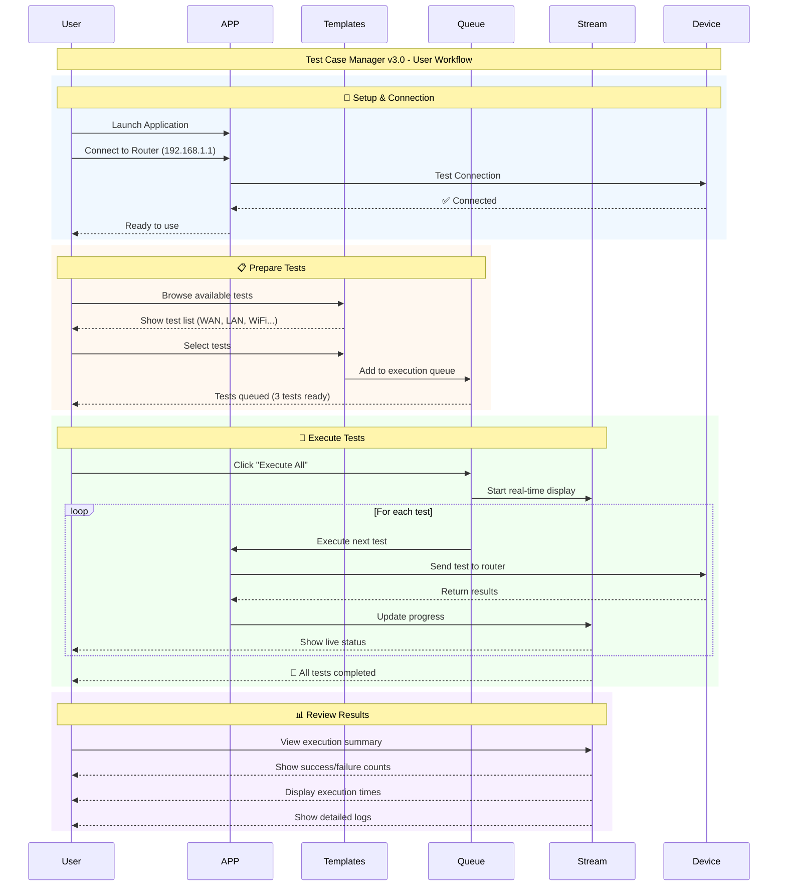

# Test Case Manager v3.0 - Hướng dẫn sử dụng

**Công cụ quản lý và thực thi Test Case toàn diện cho thiết bị OpenWrt**

[](https://github.com/juno-kyojin/winapp)
[](https://github.com/juno-kyojin/winapp)
[](https://python.org)

## 📋 Mục lục

1. [Tổng quan](#-tổng-quan)
2. [Cài đặt và khởi chạy](#-cài-đặt-và-khởi-chạy)
3. [Hướng dẫn sử dụng ứng dụng](#-hướng-dẫn-sử-dụng-ứng-dụng)
4. [Kiến trúc hệ thống](#-kiến-trúc-hệ-thống)
5. [Xử lý sự cố](#-xử-lý-sự-cố)

## 🚀 Tổng quan

Test Case Manager v3.0 là ứng dụng Windows chuyên nghiệp được thiết kế để kiểm thử toàn diện các thiết bị OpenWrt. Ứng dụng cung cấp giao diện trực quan để tạo, quản lý và thực thi các test case từ xa thông qua giao thức HTTP.

### ✨ Tính năng chính

- 🎯 **Thực thi test từ xa**: Chạy test case trên thiết bị OpenWrt từ máy tính Windows
- 📊 **Giám sát thời gian thực**: Theo dõi trực tiếp tiến trình thực thi test
- 🔄 **Xử lý hàng loạt**: Thực thi nhiều test case tuần tự với quản lý hàng đợi
- 🌐 **Kiểm thử mạng**: Kiểm thử toàn diện kết nối và hiệu suất mạng
- 📡 **Kiểm thử không dây**: Hỗ trợ chuyên biệt cho cấu hình và kiểm thử WiFi
- 📈 **Phân tích kết quả**: Kết quả test chi tiết với theo dõi thời gian thực thi
- 🔒 **Theo dõi giao dịch**: ID giao dịch duy nhất để ánh xạ kết quả đáng tin cậy
- 🎨 **Giao diện chuyên nghiệp**: GUI sạch sẽ với logo thương hiệu và thiết kế trực quan
- ⚡ **Ứng dụng độc lập**: Không cần cài đặt Python cho người dùng cuối

## 📦 Cài đặt và khởi chạy

### 🔧 Yêu cầu hệ thống

| Thành phần | Yêu cầu |
|-----------|-------------|
| **Hệ điều hành** | Windows 10/11 (64-bit) |
| **Mạng** | Kết nối TCP đến thiết bị OpenWrt |
| **Cổng** | Cổng 6262 mở trên thiết bị OpenWrt |
| **Bộ nhớ** | Tối thiểu 4GB RAM |
| **Dung lượng** | 100MB dung lượng trống |

### 🚀 Khởi chạy nhanh (Ứng dụng độc lập)

**Dành cho người dùng cuối - Không cần cài đặt Python:**

1. **Tải xuống** phiên bản mới nhất từ thư mục release
2. **Giải nén** file nén vào vị trí mong muốn
3. **Chạy** `TestCaseManager.exe`
4. **Cấu hình** kết nối thiết bị OpenWrt trong tab Connection

### 🛠️ Chạy từ mã nguồn

**Dành cho nhà phát triển:**

```bash
# Clone repository
git clone https://github.com/juno-kyojin/winapp.git
cd winapp/test_case_manager_v3

# Cài đặt dependencies
pip install -r requirements.txt

# Chạy từ mã nguồn
python run.py
```

### 🌐 Cấu hình kết nối

#### Thiết lập ứng dụng PC:
1. **Khởi chạy** ứng dụng Test Case Manager v3.0
2. **Chuyển** đến tab "Connection"
3. **Cấu hình** thông tin kết nối:
   - **Host**: Địa chỉ IP thiết bị OpenWrt (ví dụ: `192.168.1.1`)
   - **Port**: `6262` (cổng mặc định của communicate server)
   - **Connect Timeout**: `5` giây (thời gian chờ kết nối)
   - **Read Timeout**: `40` giây (khuyến nghị cho wireless tests)
4. **Nhấn** "Test Connection" để kiểm tra kết nối
5. **Lưu** cấu hình bằng nút "Save Settings"
#### Thiết lập thiết bị OpenWrt:
```bash

# Khởi động test execution engine + communicate
cd /path/to/rnd_autotest
./auto_test
```

**Kiểm tra dịch vụ:**
```bash
# Kiểm tra communicate server đang chạy
netstat -ln | grep 6262

# Kiểm tra auto_test đang giám sát
ps | grep auto_test
```

## � Hướng dẫn sử dụng ứng dụng

### 🖥️ Giao diện chính

Ứng dụng Test Case Manager v3.0 có giao diện với 5 tab chính:

#### 1. � Tab Connection (Kết nối)
**Mục đích**: Cấu hình và quản lý kết nối đến thiết bị OpenWrt

**Các thành phần**:
- **Connection Type**: Chọn loại kết nối (HTTP/SSH)
- **Host**: Địa chỉ IP thiết bị OpenWrt
- **Port**: Cổng kết nối (mặc định 6262)
- **Timeout Settings**: Cấu hình thời gian chờ
- **Connection Status**: Hiển thị trạng thái kết nối

**Hướng dẫn sử dụng**:
1. Nhập địa chỉ IP thiết bị OpenWrt (ví dụ: `192.168.1.1`)
2. Đảm bảo Port là `6262`
3. Đặt Connect Timeout = `5` giây
4. Đặt Read Timeout = `40` giây (cho wireless tests)
5. Nhấn "Test Connection" để kiểm tra
6. Khi kết nối thành công, nhấn "Save Settings"

#### 2. 📋 Tab Templates (Mẫu test)
**Mục đích**: Chọn và cấu hình các test case

**Các thành phần**:
- **Category Selection**: Chọn loại test (LAN, WAN, WIRELESS, NETWORK)
- **Test List**: Danh sách các test case có sẵn
- **Parameter Configuration**: Cấu hình tham số cho test
- **Add to Queue**: Thêm test vào hàng đợi thực thi

**Hướng dẫn sử dụng**:
1. Chọn category từ dropdown (LAN/WAN/WIRELESS/NETWORK)
2. Chọn test case từ danh sách
3. Cấu hình các tham số cần thiết trong form
4. Nhấn "Add to Queue" để thêm vào hàng đợi
5. Lặp lại để thêm nhiều test case

#### 3. 📝 Tab Queue (Hàng đợi)
**Mục đích**: Quản lý và thực thi hàng loạt test case

**Các thành phần**:
- **Queue List**: Danh sách test case trong hàng đợi
- **Queue Controls**: Các nút điều khiển (Execute All, Clear Queue)
- **Test Reordering**: Sắp xếp lại thứ tự test (Move Up/Down)
- **Individual Controls**: Xóa từng test riêng lẻ

**Hướng dẫn sử dụng**:
1. Xem danh sách test đã thêm vào queue
2. Sử dụng "Move Up"/"Move Down" để sắp xếp thứ tự
3. Nhấn "Execute All" để chạy tất cả test
4. Theo dõi tiến trình trong tab Stream
5. Sử dụng "Clear Queue" để xóa tất cả test

#### 4. 📊 Tab Stream (Giám sát thời gian thực)
**Mục đích**: Theo dõi tiến trình thực thi test và xem kết quả

**Các thành phần**:
- **Current Test Info**: Thông tin test đang chạy
- **Progress Indicators**: Thanh tiến trình và trạng thái
- **Execution Log**: Log chi tiết quá trình thực thi
- **Results Summary**: Tóm tắt kết quả (Pass/Fail/Total)

**Hướng dẫn sử dụng**:
1. Chuyển đến tab này khi bắt đầu thực thi test
2. Theo dõi "Current Test" để biết test nào đang chạy
3. Xem "Execution Time" để biết thời gian thực thi
4. Đọc log để hiểu chi tiết quá trình
5. Kiểm tra kết quả cuối cùng (Success/Failed)

#### 5. � Tab Logs (Nhật ký hệ thống)
**Mục đích**: Xem log hệ thống và debug

**Các thành phần**:
- **Log Level Filter**: Lọc theo mức độ log (INFO, WARNING, ERROR)
- **Real-time Log Display**: Hiển thị log thời gian thực
- **Log Search**: Tìm kiếm trong log
- **Export Functions**: Xuất log ra file

**Hướng dẫn sử dụng**:
1. Chọn mức độ log muốn xem (INFO/WARNING/ERROR)
2. Theo dõi log thời gian thực khi chạy test
3. Sử dụng tìm kiếm để tìm thông tin cụ thể
4. Xuất log khi cần báo cáo lỗi
### 🔄 Quy trình làm việc cơ bản

#### Quy trình thực thi test đơn lẻ:
1. **Chuẩn bị**: Kết nối thiết bị OpenWrt và cấu hình connection
2. **Chọn test**: Vào tab Templates, chọn category và test case
3. **Cấu hình**: Điền các tham số cần thiết cho test
4. **Thực thi**: Nhấn "Execute Test" để chạy ngay lập tức
5. **Theo dõi**: Chuyển sang tab Stream để xem tiến trình
6. **Kết quả**: Xem kết quả test (Pass/Fail) và thời gian thực thi

#### Quy trình thực thi test hàng loạt:
1. **Chuẩn bị**: Đảm bảo kết nối ổn định với thiết bị
2. **Thêm test**: Sử dụng tab Templates để thêm nhiều test vào Queue
3. **Sắp xếp**: Dùng tab Queue để sắp xếp thứ tự thực thi
4. **Thực thi**: Nhấn "Execute All" để chạy tất cả test
5. **Giám sát**: Theo dõi tiến trình trong tab Stream
6. **Phân tích**: Xem tổng kết kết quả và log chi tiết

### 📊 Hiểu kết quả test

#### Trạng thái test:
- **🟢 Success**: Test thực thi thành công, kết quả đạt yêu cầu
- **🔴 Failed**: Test thất bại hoặc không đạt yêu cầu
- **🟡 Timeout**: Test bị timeout, có thể do mạng chậm
- **⚪ Pending**: Test đang chờ trong hàng đợi
- **🔵 Running**: Test đang được thực thi

#### Thông tin kết quả:
- **Execution Time**: Thời gian thực thi test (giây)
- **Transaction ID**: Mã định danh duy nhất của test
- **Response Data**: Dữ liệu phản hồi từ thiết bị
- **Error Messages**: Thông báo lỗi (nếu có)

### 🎯 Các loại test phổ biến

#### 1. **Network Tests** (Kiểm thử mạng):
- **Ping Test**: Kiểm tra kết nối internet
- **Speed Test**: Đo tốc độ mạng
- **DNS Test**: Kiểm tra phân giải tên miền

#### 2. **LAN Tests** (Kiểm thử mạng nội bộ):
- **LAN IP Configuration**: Cấu hình địa chỉ IP LAN
- **DHCP Settings**: Cấu hình DHCP server
- **Port Forwarding**: Cấu hình chuyển tiếp cổng

#### 3. **WAN Tests** (Kiểm thử mạng WAN):
- **WAN Connection**: Kiểm tra kết nối WAN
- **PPPoE Configuration**: Cấu hình PPPoE
- **Static IP Setup**: Cấu hình IP tĩnh

#### 4. **Wireless Tests** (Kiểm thử không dây):
- **WiFi AP Configuration**: Cấu hình Access Point
- **WiFi Security**: Kiểm tra bảo mật WiFi
- **Signal Strength**: Đo cường độ tín hiệu

## 🏗️ Kiến trúc hệ thống

### 📋 Tổng quan kiến trúc

Hệ thống Test Case Manager v3.0 bao gồm hai thành phần chính:

1. **Test Case Manager v3.0** (Windows PC): Ứng dụng GUI để quản lý và giám sát test
2. **OpenWrt Device**: Thiết bị chạy các thành phần server và test execution

### 🔄 Sơ đồ luồng thực thi



### 🔧 Thành phần hệ thống

#### Phía Windows PC:
- **Main Application**: Giao diện chính với 5 tab
- **Connection Manager**: Quản lý kết nối HTTP đến thiết bị
- **Test Case Loader**: Tải và quản lý template test
- **Queue Manager**: Quản lý hàng đợi thực thi
- **Stream Monitor**: Giám sát thời gian thực
- **Result Manager**: Xử lý và lưu trữ kết quả

#### Phía OpenWrt Device:
- **communicate**: HTTP server nhận request từ PC (port 6262)
- **auto_test**: Engine thực thi test case trên thiết bị
- **Result Files**: File kết quả được tạo sau khi test hoàn thành

### 🌐 Giao thức giao tiếp

#### HTTP API Endpoints:
- `POST /`: Gửi test case để thực thi (root endpoint)
- `GET /check_result/{transaction_id}`: Kiểm tra kết quả test
- `GET /ping`: Kiểm tra trạng thái server

#### Luồng dữ liệu:
1. PC gửi test case qua HTTP POST
2. Device nhận và thực thi test
3. Device tạo file kết quả với transaction ID
4. PC polling để lấy kết quả qua HTTP GET
5. PC hiển thị kết quả cho người dùng

## 🛠️ Xử lý sự cố

### ❌ Lỗi kết nối thường gặp

#### 1. Connection Timeout
**Triệu chứng**: "Connection timeout" trong tab Connection
**Nguyên nhân**:
- Thiết bị OpenWrt không khả dụng
- Port 6262 bị chặn
- Mạng không ổn định

**Giải pháp**:
```bash
# Kiểm tra kết nối mạng
ping 192.168.1.1

# Kiểm tra port 6262
telnet 192.168.1.1 6262

# Khởi động lại server

./server
```

#### 2. Test Execution Failed
**Triệu chứng**: Test hiển thị "Failed" trong Stream
**Nguyên nhân**:
- Tham số test không hợp lệ
- Thiết bị không hỗ trợ test
- Lỗi trong quá trình thực thi

**Giải pháp**:
1. Kiểm tra log trong tab Logs
2. Xác minh tham số test trong Templates
3. Thử test đơn giản trước (ping test)
4. Kiểm tra auto_test process trên device

#### 3. Wireless Test Timeout
**Triệu chứng**: Wireless test bị timeout thường xuyên
**Nguyên nhân**: Wireless test cần thời gian dài hơn

**Giải pháp**:
1. Tăng Read Timeout lên 60-90 giây
2. Kiểm tra cường độ tín hiệu WiFi
3. Đảm bảo không có interference

### 🔍 Debug và troubleshooting

#### Kiểm tra log hệ thống:
1. Mở tab Logs trong ứng dụng
2. Đặt filter = "ERROR" để xem lỗi
3. Tìm kiếm transaction ID cụ thể
4. Xuất log để báo cáo

#### Kiểm tra trạng thái device:
```bash
# Kiểm tra process đang chạy
ps | grep communicate

# Kiểm tra port listening
netstat -ln | grep 6262

# Kiểm tra log device (nếu có)
tail -f application.log
```

#### Test kết nối thủ công:
```bash
# Test ping endpoint
curl -X GET http://192.168.1.1:6262/ping

# Test gửi test case
curl -X POST http://192.168.1.1:6262/ \
  -H "Content-Type: application/json" \
  -d '{"test_cases":[{"service":"ping","params":{"host":"8.8.8.8"}}]}'
```

### 📞 Hỗ trợ kỹ thuật

Khi gặp sự cố không thể tự giải quyết:

1. **Thu thập thông tin**:
   - Screenshot lỗi từ ứng dụng
   - Log từ tab Logs (xuất ra file)
   - Thông tin cấu hình mạng
   - Phiên bản ứng dụng và OpenWrt

2. **Thông tin cần cung cấp**:
   - Mô tả chi tiết sự cố
   - Các bước đã thực hiện
   - Thời điểm xảy ra lỗi
   - Loại test gây ra sự cố

3. **Tài liệu tham khảo**:
   - File README.md này
   - Log files trong `data/logs/`
   - Template files trong `data/templates/`
---

## 📝 Lưu ý quan trọng

> ⚠️ **Trước khi kiểm thử:**
> - Luôn kiểm tra kết nối trước khi thực thi test case
> - Wireless tests cần thời gian hoàn thành lâu hơn - hãy kiên nhẫn
> - Theo dõi tab Stream để cập nhật tiến trình thời gian thực
> - Sao lưu các test case quan trọng thường xuyên
> - Tuân thủ quy ước đặt tên để tổ chức tốt hơn

> 🔧 **Nhận hỗ trợ:**
> - Kiểm tra phần xử lý sự cố trước tiên
> - Bật verbose logging để debug
> - Theo dõi log phía device khi cần thiết
> - Liên hệ team phát triển để được hỗ trợ kỹ thuật

---

**Test Case Manager v3.0** - Công cụ quản lý và thực thi test case chuyên nghiệp cho thiết bị OpenWrt

Copyright © 2025. Tất cả quyền được bảo lưu.
